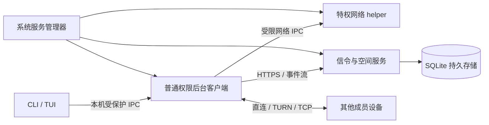

# frp-sh 后台服务、永久空间与短期邀请改造计划

日期：2026-09-13
代码基线：已发布 0.5.4，信令协议 v3，helper 协议 v2。
状态：目标设计，正在实施。本文描述完整目标，不是当前发布版使用手册；已实现和待验收内容见同目录的 background-spaces-progress 记录。0.5.5 仅发布了 status 和 Profile 监督进程，完整能力完成并验收前不会标为已交付。

## 1. 结论与范围

可以实现，而且适合将 frp-sh 从一次性终端会话升级为常驻组网工具。保留现有键盘终端，增加后台客户端和统一控制入口；不需要重新引入网页 GUI。

核心约定：

1. 空间默认永久存在，无固定到期时间；关闭终端、设备关机和服务端重启都不删除空间。
2. 邀请默认 15 分钟有效，由服务端设置默认值和最大值。邀请只用于加入，不是后续连接凭据。
3. 设备成功加入后取得独立成员身份，重启后可以自动重连；邀请到期不影响已有成员。
4. 一条命令可以完成所需安装、登记和启动步骤，但首次注册系统服务仍可能弹出管理员授权；不承诺绕过操作系统权限。
5. 服务器、后台客户端、特权网络 helper 分离；CLI/TUI 通过本机受保护 IPC 查询和控制后台客户端。
6. 保留 LAN、game/dev 场景预设及显式服务发布。默认只连接虚拟网络，不暴露物理局域网或开放出口代理。

“永久”指没有自动到期时间，不代表无限人数、无限带宽、不可删除或公益服务器永远可用。

## 2. 现状核对

| 能力 | 当前实现 | 差距及改动入口 |
| --- | --- | --- |
| 无 GUI 服务端 | `serve` 可以前台进程运行，已有 Linux systemd 部署 | 缺少统一的跨平台服务安装、生命周期管理与 status 命令；`src/cli.rs`、`src/commands.rs` |
| 无交互客户端 | `--plain` 关闭交互输出，适合外部监督进程 | 不等于常驻客户端；缺少独立会话进程、本机控制协议及开机恢复 |
| 系统网络服务 | `frp-sh-net` 已有 Windows SCM、Unix 平台集成 | helper 只负责受限网络操作，不保存完整组网会话；`src/helper/` |
| 状态查询 | 当前进程统计、TUI、doctor、日志 | 无 `frp-sh status` 跨进程状态入口；`src/stats.rs` 使用进程全局状态 |
| 邀请 | `src/invite.rs` 将 JSON 做 hex 编码放入 `#v2.`；字段含 password/key | 编码不是加密，正常房间流程使用房间凭据，但结构仍能携带配置凭据；无服务端兑换与 15 分钟到期 |
| 一行安装加入 | 已生成 PowerShell / shell 安装后 connect 命令 | 还不能自动保存后台运行意图、配置开机启动并安全交接服务身份 |
| 房间有效期 | `src/presets.rs` 默认 43200 秒；预设限制 60–604800 秒 | 服务端拒绝 ttl=0，最长七天；到期字段与中继定时器都要改 |
| 房间持久化 | `src/signaling/server.rs` 使用内存 HashMap | 重启丢失；部分房主结束路径主动 delete_room |
| 房间拓扑 | 多访客，但连接和中继组织仍依赖房主角色 | 永久空间不能只把 TTL 调大，需将空间所有权与在线转发角色解耦 |
| 容量配额 | 1024 房间、33 人/房间、33792 总登记名额为默认上限 | 永久空间须明确登记名额、在线数、活跃连接数，不能假装是同一计数 |

目前不是完全从零开发：安装校验、helper 权限边界、日志、服务多路复用和房间配额可复用；会话所有权、身份和持久化是主要新增工作。

## 3. 面向用户的命令设计（提案）

命名原则：继续使用 create/join，`--background` 表示“交给常驻服务运行并保存开机恢复意图”，不引入另一套客户端命令语言。

| 目的 | 拟议命令 | 完成后的行为 |
| --- | --- | --- |
| 打开交互终端 | `frp-sh` | 连接已有本机后台服务，展示并管理状态 |
| 创建永久空间并开机恢复 | `frp-sh create --name friends --background` | 幂等登记本地连接任务，创建空间并启用自动恢复 |
| 场景预设 | `frp-sh create game --background` | 仍是 LAN 参数预设 |
| 使用邀请加入并开机恢复 | `frp-sh join '<邀请链接>' --background` | 兑换邀请、保存设备成员身份、启动后台任务 |
| 已授权设备恢复空间 | `frp-sh join <空间别名> --background` | 使用本机已保存身份；不要求再次使用邀请 |
| 状态 | `frp-sh status` | 同时展示本机 server/client/helper 状态及连接摘要 |
| 脚本状态 | `frp-sh status --json` | 返回稳定 schema，不输出凭据 |
| 生成邀请 | `frp-sh invite <空间> --uses 1` | 默认单次使用、服务端默认 15 分钟 |
| 为多人生成邀请 | `frp-sh invite <空间> --uses 5 --expires 15m` | 最多五个新成员，仍受服务器配额限制 |
| 复制安装加入命令 | `frp-sh invite <空间> --command windows` | 输出一个不含长期密码的安装加入命令；支持 linux/macos |
| 暂停本地自动连接 | `frp-sh stop <空间>` | 停止该任务且关闭其自动恢复，不退出成员关系、不删空间 |
| 恢复本地自动连接 | `frp-sh start <空间>` | 恢复任务和开机连接意图 |
| 离开空间 | `frp-sh leave <空间>` | 撤销本设备成员身份并清理本地路由与凭据 |
| 删除空间 | `frp-sh space delete <空间>` | 仅 owner 可执行；另有明确确认，不复用 stop |
| 启动服务端系统服务 | `frp-sh serve --install-service --config /path/server.toml` | 校验配置、注册并启动服务、启用开机启动；重跑幂等 |

已有 `connect` 作为 join 邀请的兼容别名。普通无 `--background` 命令继续允许前台会话；退出仅关闭本地会话，不自动删除新协议的永久空间。

四位数字只保留为已登录服务器范围内的短别名，不是授权依据，也不作为永久全局唯一 ID。陌生设备仅凭四位数字不得绕过邀请；没有授权时明确提示需要邀请。

第一版每个后台客户端仅允许一个活跃 LAN 空间，防止现有固定虚拟网段与全局统计互相冲突；可以保存多个空间并切换。并行多空间需要独立网段、网卡/路由命名空间和会话隔离，作为后续阶段。

一行首次安装加入由官网生成平台专用命令，安装器新增经过严格解析的 invite/background 参数。不在本计划中提供尚未实现的可执行在线安装示例。执行链必须在下载、校验、安装、兑换任一步失败时停止，不能出现安装失败却调用旧 PATH 程序的情况。

## 4. 三个独立生命周期

| 对象 | 默认生命周期 | 失效条件 |
| --- | --- | --- |
| 空间 Space | `expires_at = null`，永久 | owner 删除、管理员停用；显式设置期限的临时空间按期限到期 |
| 邀请 Invite | 900 秒 | 到期、使用次数耗尽、owner 撤销、空间停用 |
| 成员 Membership | 持久保存 | 主动离开、踢出、设备凭据撤销、空间删除 |
| 在线会话 Presence | 短期租约，建议心跳 20 秒、60 秒判离线 | 心跳丢失；重新认证后可恢复，不释放登记名额 |
| 访问凭据 | 短期，建议 10 分钟并自动刷新 | 到期、权限版本变化、成员撤销 |

邀请在 15 分钟内兑换成功后，设备关机一个月再启动也可以恢复成员身份，只要该成员未撤销且服务器可达。服务端时间裁定邀请过期；断线退避用单调时钟，不能通过修改客户端时间延长邀请。

## 5. 服务架构与权限



后台进程是连接状态的唯一所有者。TUI 关闭不停止连接，重新打开只附着，不再启动第二套网络会话。抽取 SessionManager，逐步消除 `stats`、邀请、终端模块中的单会话全局变量。首版可保持单活跃会话，但接口必须以 session_id 区分状态。

本机 IPC 使用 Unix socket 或 Windows Named Pipe，校验 OS 对端身份并设置 ACL；禁止无认证 localhost HTTP 管理接口。普通用户只控制安装时分配给自己的任务；服务端管理状态只允许管理员或显式授权运营账户查询。

| 平台 | 开机且未登录时运行 | 权限落地 |
| --- | --- | --- |
| Linux | systemd 系统单元，以专用非特权 UID 运行 client/server | helper 单独拥有网络特权；不把用户 user service 默认等同开机启动 |
| Windows | 真正 SCM 服务，自动/延迟自动启动，支持停止与恢复 | client 使用受限服务身份/Service SID；helper 保留隔离权限；不能直接 `sc create` 包装普通 console 程序 |
| macOS | LaunchDaemon，而非仅登录后启动的 LaunchAgent | 指定非 root 服务账户；helper 与账户授权单独配置 |
| OpenWrt | 后续通过 procd 适配 | 暂不作为首批全平台验收承诺 |

当前 helper 绑定安装用户 SID/UID 并校验可执行文件身份。新增 service 身份必须更新受保护策略，不能放宽为“所有本地用户”或取消程序路径检查。安装器一次完成注册、目录权限、服务身份和 helper 授权。后续修改空间、状态查询和重连走受限 IPC，无需再次提权；升级、卸载及变更系统级授权仍属于安装维护操作。

服务身份与登录用户不同，不能假设可读取用户 HOME、HKCU、钥匙串或 DPAPI 用户凭据。凭据通过认证 IPC 导入服务专用存储，采用平台保护和严格目录 ACL；Windows 的机器级保护不能替代文件 ACL。系统服务参数、环境变量、状态输出不保存或展示长期秘密。

## 6. 短期动态邀请与设备身份

“动态密钥”落地为随机的一次性/限次邀请令牌，不采用可逆配置编码或按时间可预测的数字。示例形态为 `https://frp.sh/join#v3.<邀请封装>`，封装只携带协议版本、经校验的服务端 HTTPS 地址和随机令牌；禁止携带 password、owner token、长期成员凭据或用户的共享 `--key`。

建议令牌至少 256 bit 随机熵，服务端只存令牌摘要、空间、签发者、到期时间、剩余次数和撤销状态。链接自身仍是临时 bearer 凭据，15 分钟内持有人可申请加入；“不显示密码”不代表链接可公开。支持一键撤销。

兑换流程：

1. 设备生成并安全保存设备密钥；不将 UUID 当作身份证明。
2. CLI 校验邀请格式、HTTPS 来源及大小，直接向对应服务器请求兑换；不让官网服务器代请求任意地址。
3. 用服务端挑战证明持有设备私钥，提交邀请、设备公钥和幂等 request_id。
4. 单个数据库事务中验证期限/次数/权限，检查人数配额，建立成员关系并扣减次数。房间满员或事务失败不消耗邀请。
5. 重试绑定相同设备及 request_id，网络响应丢失不重复占名额；同一设备重复兑换不创建第二个成员。
6. 返回设备绑定的成员授权和短期访问凭据。后续开机用设备身份证明刷新访问令牌，永远不重新消费邀请。

成员撤销必须同时使刷新权限、信令订阅、中继授权失效；向在线对端下发成员版本更新并关闭对应连接。P2P 已建立连接无法保证在控制面完全分区时瞬时撤销，规定最大授权租约（建议 10 分钟）后必须重新验证，安全失败时断开；文档明确这个边界。

端到端加密不能再依赖邀请内明文携带长期 `--key`。新协议采用经审查的设备密钥认证与点对点会话密钥协商，绑定 space_id 和成员身份、支持密钥确认；不自造密码算法。旧手动 `--key` 作为兼容/高级路径，禁止自动放进新邀请。若需要对恶意信令运营者也验证成员身份，应加入 owner 签名/指纹核验或采用成熟组成员协议，作为明确的密码设计评审门槛，不能仅凭 HTTPS 宣称实现。

加入页禁止第三方脚本读取 fragment；兑换后清除 fragment，不写日志、埋点、错误上报。系统剪贴板和 shell 历史仍可能保存短期令牌，默认单次使用并提供 stdin 导入路径减少暴露。安装命令只使用固定模板和严格转义，不执行邀请携带的任意脚本或下载地址。

## 7. 永久空间、持久化与组网

建议首版单实例 SQLite（事务、迁移版本、WAL、备份恢复），不引入 Redis 等额外部署依赖。横向扩容不是首版承诺。

持久化：spaces、memberships、devices/public_keys、invites/digests、server_settings、audit_events、客户端 desired_sessions 与凭据引用。space_id 使用高熵稳定 ID；用户可见别名与 ID 分离。短码可回收但不能让旧 Profile 因短码复用加入另一空间，Profile 必须绑定 server identity + space_id。

仅内存保存：在线地址、候选端点、连接统计、TURN allocation、socket、配对槽位和任务句柄。服务器重启从库恢复空间和成员，在线状态重置为未知/离线；设备重新注册候选与租约，不恢复陈旧 NAT 映射。

TTL 改为显式枚举/Option：永久为 null，临时空间为明确 expires_at。不能用 u64::MAX 或把 ttl=0 直接改义而忽略旧客户端。需要同时修改 create 请求、RoomInfo、预设表单、邀请展示、定时清理、中继到期关闭和房主退出逻辑。

创建者成为空间 owner，而不是空间必须依赖的在线路由器。LAN 成员之间通过规范化 peer-pair ID（排序后的两个设备 ID）建立独立连接，避免双方重复配对；中继授权逐对检查两端当前成员资格。离线 owner 不应阻止其他已授权成员相连或兑换已签发邀请。

显式开发服务仍依赖实际发布设备：owner 离线时空间可以存在，但该设备上的 Web/游戏服务显示不可用，不能宣称服务器托管了这些服务。默认不选其他用户设备作为转发网关；如后续加入此能力，必须单独 opt-in 和限额。

## 8. 服务端策略与公益配额

以下为新 server.toml 设计示例，不是当前文件格式：

```toml
[spaces]
default_ttl = "forever"
allow_permanent = true
max_spaces = 20
max_members_per_space = 8
max_total_members = 100
max_spaces_per_owner = 3

[invites]
default_ttl = "15m"
max_ttl = "24h"
default_uses = 1
max_uses = 32
max_outstanding_per_space = 20
```

保留 0.5.4 的 max-rooms/max-members/max-total-members 为兼容别名；CLI 显式参数优先于文件，最终策略可在受保护管理接口查询。普通 owner 可缩短邀请期限，不能突破服务端上限；已有邀请不因修改默认值自动延长。

永久空间的登记名额会持续占用，离线不释放；通过 leave/kick/delete 释放。另统计 online_members、active_relay_pairs、pending_invites，不能用这些指标替代登记配额。

公益防滥用最小要求：创建者需授权，限制每 owner 空间数、每来源请求速率、未兑换邀请数、兑换并发和中继配对数；配额在事务中校验。密码、令牌与源 IP 均不作为唯一用户身份。空间清理/停用必须明确告知，默认不暗中给永久空间加空闲过期。

带宽公平限速和月流量预算应在公开放量前完成；此计划不把“人数上限”当作带宽保护。先采用明确总带宽/每空间预算，再压测制定人数，避免用此前估算值作为保证。

## 9. status 与控制面契约

`frp-sh status` 即使服务停机也能区分未安装、已安装未运行、权限不足和服务运行但离线；通过 OS 服务状态 + 受保护 IPC 查询，不只读取残留文件。

建议输出：

```text
Client   running · starts at boot
Server   not installed
Helper   ready
Space    friends · persistent
Network  connected · 3/5 devices online
Links    direct 2 · relay 1
Latency  peer-a 18 ms · peer-b unavailable
Updated  1 second ago
```

状态机至少包含 starting、waiting_network、auth_required、joining、connected、degraded、reconnecting、stopped、revoked、error。区分注册成功、存在对端、数据面可用，不把 `WAIT` 显示为已连接。无 RTT 样本显示 unavailable，不能显示虚假 0ms。

JSON 含 schema_version、observed_at、service/client/helper 状态、space_id、成员数、逐链路延迟/流量、最近错误码；禁止返回邀请及长期密钥。全量拓扑仅按授权显示，不默认展示物理局域网。

CLI 返回码建议：0 所选任务健康、1 明确故障、2 降级/正在恢复、3 未配置或未运行、4 权限不足。可选 `--client`/`--server` 限定检查对象，未安装的非目标角色不导致健康客户端判失败。JSON 状态值与 schema 做兼容版本管理。

## 10. 改动拆分与接口草案

| 模块 | 主要修改 |
| --- | --- |
| `src/cli.rs` / `src/main.rs` | 新增 status、后台标志、invite、space 生命周期和服务安装入口 |
| 新 `src/runtime/` | SessionManager、重连、desired state、取消及数据面状态；UI 不再拥有任务 |
| 新 `src/agent/` | 常驻进程、本机 IPC、启动恢复、单实例锁、服务调度入口 |
| `src/helper/platform.rs` / 安装器 | 服务身份授权、IPC ACL、启动依赖、事务安装和回滚 |
| `src/signaling/server.rs` 拆分 | 空间/成员/邀请/配额逻辑和数据库，避免继续增长单文件 |
| 新 `src/storage/` | SQLite 迁移、空间和成员事务、备份恢复 |
| `src/invite.rs` / join 网页 | v3 短期令牌、兑换流程、复制安全、旧格式提示 |
| `src/p2p/relay.rs` / TURN | peer-pair 认证、短期授权、撤销及到期断流 |
| `src/stats.rs` / `src/terminal.rs` / `src/app.rs` | 按会话状态快照、订阅后台事件、status 与 TUI 共用模型 |
| `src/config.rs` / `src/presets.rs` | 凭据引用、永久 TTL、新旧 Profile 迁移、服务配置独立路径 |

建议新增协议接口：`POST /spaces`、`POST /spaces/{id}/invites`、`POST /invites/redeem`、设备 challenge/token、成员撤销、space 事件订阅。最终请求 schema、错误码、幂等规则和认证矩阵在编码前冻结。兑换接口不能要求尚未加入的用户提供服务器管理密码；使用高熵邀请、设备挑战及严格速率/成本限制。

用有界事件订阅替代房主每 100 ms 全量轮询，带版本游标、断线后快照恢复、慢客户端队列上限；保留低频轮询作降级。控制面限速不能阻断健康会话的令牌刷新。

## 11. 交付阶段与验收门槛

| 阶段 | 范围 | 验收 |
| --- | --- | --- |
| P0 契约与风险验证 | 冻结命令/状态/身份/TTL 模型，验证三平台服务账户与 helper 的可行性 | 可重复安装，普通 CLI 能控制自己任务，其他本地用户被拒绝 |
| P1 常驻客户端 | SessionManager、IPC、status、系统服务、desired state；暂沿用现有房间生命周期 | 关终端不掉线；重启后无登录自动运行；网断/恢复可自动重连 |
| P2 永久空间 | SQLite、空间/成员分离、永久 TTL、稳定身份、owner 离线解耦 | 服务端重启恢复空间；owner 关机后其他两名成员互通；服务提供者离线明确不可用 |
| P3 短期邀请 | 15 分钟服务端策略、事务兑换、设备凭据、撤销与加密集成 | 单次邀请并发兑换只成功一次；时间边界与重试正确；老成员重启无需新邀请 |
| P4 一行入口与迁移 | 安装器、邀请页、TUI、Profile 迁移、跨平台回滚 | 全新机器一条命令经必要授权完成安装加入；重复执行无重复服务/成员；日志无秘密 |
| P5 公益放量 | 配额/限速/压力与故障测试、中英文文档和发布 | 混合直连中继、重连风暴、慢订阅及数据库异常下有明确上限与可观测错误 |

依赖：P0 → P1/P2 → P3 → P4 → P5。P1 可先作为独立小版本交付，但不能声称已经提供永久空间或过期邀请。完整目标建议作为 0.6.0、信令协议 v4 候选；是否升级 helper 协议由 IPC 是否改变决定，不能只按产品版本盲目递增。

## 12. 测试与发布迁移

必测场景：三平台真正重启且未登录、服务崩溃恢复、同机多用户隔离、helper 不可用、网络晚于服务启动、邀请过期边界、次数耗尽、并发兑换/响应丢失、满员不扣次数、撤销后刷新失败、owner 离线、数据库重启/迁移/恢复、TTL 无限无溢出、旧短码复用、双端重复建链、有限期限房间及时断流。

安全验证：篡改来源与邀请、路径/命令注入、低熵枚举、重放、超大兑换请求、IPC 未授权用户、设备私钥泄露后单设备撤销、断控后租约截止、日志/状态/进程参数不泄露长期秘密。

v3 现有房间是易失数据，升级前通知并有控制地结束会话。不能自动将持有共享密码的所有设备推断为同一个 owner。现有 Profile 地址/显示名可迁移，旧邀请默认不升级为永久授权；通过已认证 owner 生成新邀请重新登记。需要兼容时旧协议单独实例/端口运行并注明退出日期，禁止新客户端静默降级回无过期邀请。

先备份数据库和系统服务配置，再做 schema 迁移和灰度验证。数据库迁移不保证可逆；回滚使用匹配旧二进制的备份，并说明新登记成员可能需重新加入。客户端升级同时处理 agent/helper/CLI 的协议协商与活动会话停止恢复。

## 13. 本计划采用的默认决定

- 永久空间默认开启；临时空间仍可显式设置期限。
- 邀请默认 15 分钟、单次使用；多人邀请显式指定 uses。
- 后台模式默认开机恢复，普通前台模式不偷偷注册自动启动。
- 首版只支持一个活跃 LAN 空间，保留多个已保存空间。
- 默认不提供互联网出口 VPN、不暴露物理 LAN、不转发其他设备流量。
- server/client 受限身份运行，网络特权保留在 helper。
- 不自动修改当前线上容量配置，不在计划阶段发布任何程序。

## 14. 参考与证据

本地代码证据以仓库相对路径标识，便于文档随仓库迁移：`src/cli.rs`、`src/main.rs`、`src/invite.rs`、`src/helper/service.rs`、`src/helper/platform.rs`、`src/config.rs`、`src/presets.rs`、`src/stats.rs`、`src/signaling/server.rs`、`src/signaling/limits.rs`、`src/commands.rs`、`src/services.rs`。以上现状已在 2026-09-13 读取核对。

macOS 启动模型依据 Apple 的 [Creating Launch Daemons and Agents](https://developer.apple.com/library/archive/documentation/MacOSX/Conceptual/BPSystemStartup/Chapters/CreatingLaunchdJobs.html)：系统 daemon 与用户 agent 生命周期不同，应使用前者实现未登录启动。

Windows 账户边界依据 Microsoft 的 [LocalService Account](https://learn.microsoft.com/en-us/windows/win32/services/localservice-account)：服务账户拥有自己的用户配置上下文，不能假设 HKCU/用户存储属于交互登录用户。

平台文档只支持上述生命周期与账户边界；本计划的配额、时间、模块和命令是项目设计建议，不是操作系统官方保证。
