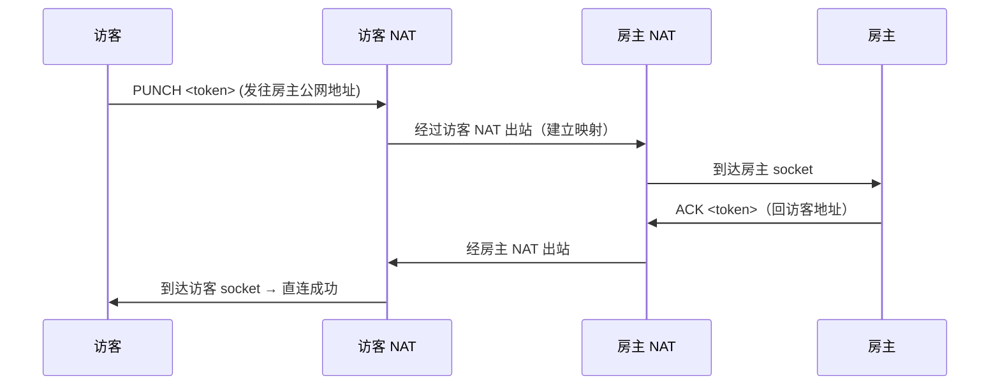
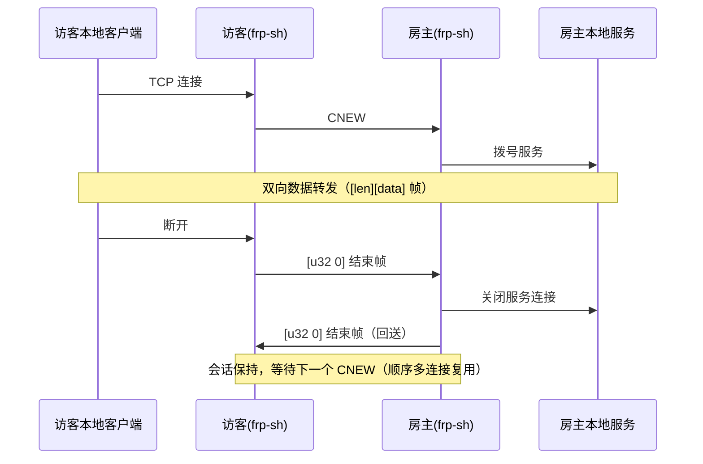
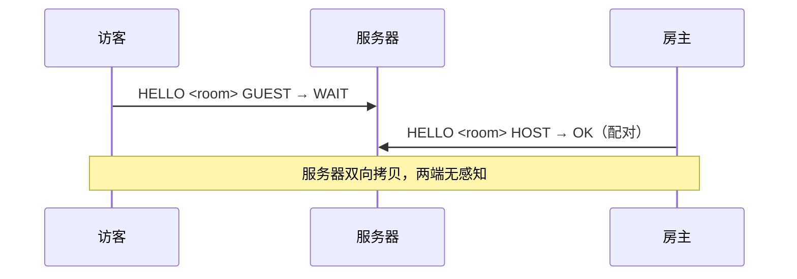
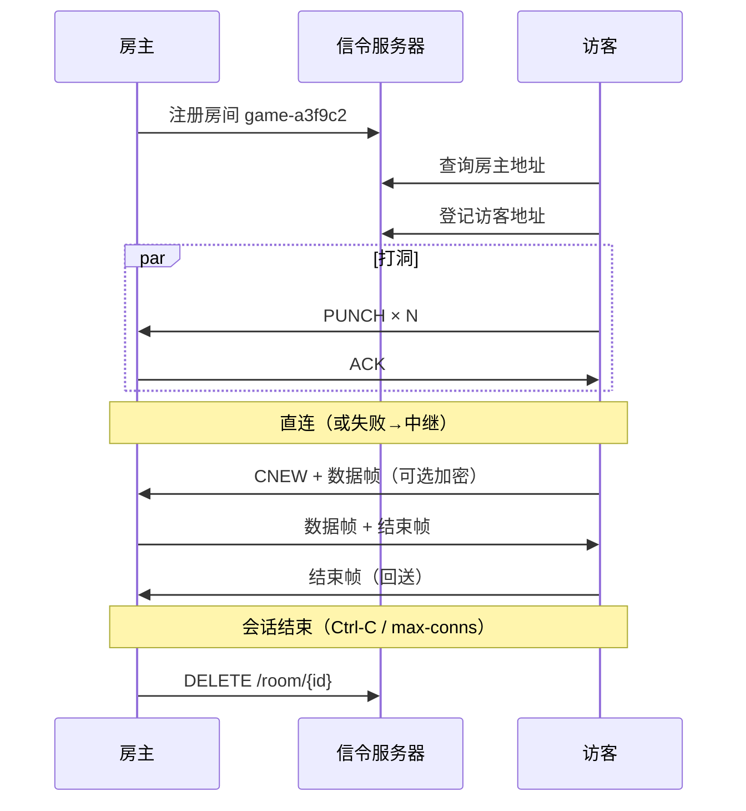

# 网络原理

frp-sh 的完整数据通路分四层：**信令**（建房间）→ **打洞**（找对方）→ **可靠流**（管传输）→ **隧道**（桥本地）。下面逐层说明。

## 1. 信令：房间制地址交换

### 公网地址探测（STUN 简化版）

NAT 之后的本机无法直接知道自己的公网地址，frp-sh 用「服务器回显」实现：

```text
客户端 UDP socket ──ECHO <token>──▶ 信令服务器
客户端 UDP socket ◀─ADDR <token> <ip>:<port>── 信令服务器
```

服务器看到的数据报源地址（`<ip>:<port>`）就是该 socket 经 NAT 映射后的公网地址。

**关键点**：探测与打洞使用**同一个 socket**，所以通告的地址就是后续打洞可用的映射；NAT 映射在该 socket 生命周期内保持有效。

### 房间注册与查询

```text
POST /room/create {prefix, ttl, addr}  →  {room_id, host_addr}
GET  /room/{id}                        →  {host_addr, guest_addr, ...}
POST /room/{id}/join {addr}            →  {host_addr}
DELETE /room/{id}
```

- 房主注册房间并通告自己的公网地址
- 访客查询房间拿到房主地址，登记自己的地址
- 房间有过期时间（`--ttl`），过期自动失效

## 2. 打洞：PUNCH/ACK 同时握手

### 为什么需要打洞

NAT 默认**拒绝入站**连接。但只要 socket 先向外发包，NAT 就会建立一条「映射」，允许**来自该目标的回包**进入（受限锥形 NAT）。打洞的本质是让双方都先向对方发数据，把彼此的映射「打通」。

### 流程



双方同时进行（房主通过轮询房间得知访客地址后也主动发包），因此可以穿透**受限锥形 NAT**——不需要严格的「先发后收」顺序。

### 端口散布（轻量端口预测）

对称 NAT 会为每个目标分配不同端口。`--spread N` 让双方除了对方通告的端口，还向 **±N 的相邻端口** 发包：

```text
目标端口: 52000
散布目标: 52000, 51999, 52001, 51998, 52002 (spread=2)
```

部分 NAT 对连续目标分配连续端口，散布可提高命中率。未命中的端口通常无人监听，产生的 ICMP 错误已被忽略，无副作用。**自身端口已被自动排除**，避免把 PUNCH 发给自己造成误判。

### 判定规则

| 收到 | 动作 |
|------|------|
| `PUNCH <token>` | 回 `ACK <token>`，记录对端地址，直连成功 |
| `ACK <token>` 且 token 匹配 | 直连成功 |
| FRS1 数据帧 | 对端已进入数据阶段，直连成功 |

打洞窗口约 3 秒，超时未打通进入中继回退。

## 3. 可靠流：FRS1 帧协议

打洞后的 UDP 是**不可靠**的（丢包/乱序），frp-sh 在 UDP 之上实现了一个轻量可靠字节流（`FRS1` 协议）：

### 帧格式（15 字节头 + 负载）

```text
+------+------+------+------+------+------+------+------+------+------+------+------+------+------+------+
| magic "FRS1" | flags |    seq u32 BE    |    ack u32 BE    |  len u16 BE   |        payload          |
|     (4B)     |  (1B) |                  |                  |               |                         |
+------+------+------+------+------+------+------+------+------+------+------+------+------+------+------+
```

- `flags`：`0x01` = 数据帧，`0x02` = FIN（关闭），无标志 = 纯 ACK 帧
- `seq`：发送序号（每帧唯一）
- `ack`：累积确认（已连续收到的最大序号 + 1）

### 可靠性机制

| 机制 | 参数 | 说明 |
|------|------|------|
| 滑动窗口 | 32 帧 | go-back-N：乱序帧丢弃，靠重传恢复 |
| 超时重传 | 150ms | 未确认帧整体重发 |
| 累积 ACK | — | 只确认连续数据，简单高效 |
| keepalive | 1s | 空闲时互发 ACK 帧，维持 NAT 映射不失效 |
| 流控 | 读写缓冲 256KB/1MB | 有界缓冲 + 窗口背压 |
| 关闭 | FIN 握手 | 5s 内未确认视为对端消失，尽力关闭 |

### 加密（可选）

`--key` 启用后，**数据帧负载**用 ChaCha20-Poly1305 加密：

- 密钥 = SHA-256(口令)（32 字节）
- nonce = 帧序号（每帧唯一，重传复用同一密文）
- ACK/FIN 帧不加密（无负载）
- 密钥不匹配时解密失败，会话报错退出

## 4. 隧道：多连接帧协议

可靠流之上是 TCP 桥接语义。为支持**一个会话多个连接**（游戏断线重连等），隧道层有独立帧协议：

```text
访客 → 房主: CNEW(4B)  [u32 len][payload]*  [u32 0]
房主 → 访客: [u32 len][payload]*  [u32 0]
```

| 元素 | 含义 |
|------|------|
| `CNEW` | 访客侧新连接建立（房主收到后拨号本地服务） |
| `[u32 len][payload]` | 数据帧（最大 1 MiB） |
| `[u32 0]` | 结束帧：本地连接关闭时发送；收到对端结束帧时回送并结束本连接 |

### 连接生命周期



两端各自的读写方向由**两个常驻任务 + 有界 channel** 驱动，从设计上避免「select 丢弃半读数据」这类并发陷阱。

## 5. 中继回退

打洞超时（约 3 秒）或 `--relay` 强制时，双方改为连接服务器中继：

```text
访客 ──TCP──▶ 服务器(8081) ◀──TCP── 房主
             （配对后双向拷贝）
```



- 配对等待最长 10 分钟，超时 `ERROR NO_PEER`
- 访客在中继连接后还会做一次 **400ms 直连复查**：若补抓到 P2P（应对「房主已打通、访客 ACK 丢失」的不对称场景），立即切回直连

## 一次完整会话的时序



## 健壮性设计要点

- **Windows ICMP 毒化**：向无人监听端口发包后，后续 recv/send 会返回 WSAECONNRESET(10054)——已识别并忽略，ACK 发送带重试
- **自我打洞防护**：打洞目标排除自身端口，接收方忽略来自自身地址的数据报
- **keepalive 保活**：NAT 映射通常 30~120 秒过期，1 秒一次的 ACK 帧维持映射
- **尽力关闭**：FIN 确认超时不报错，避免对端消失导致会话卡死
