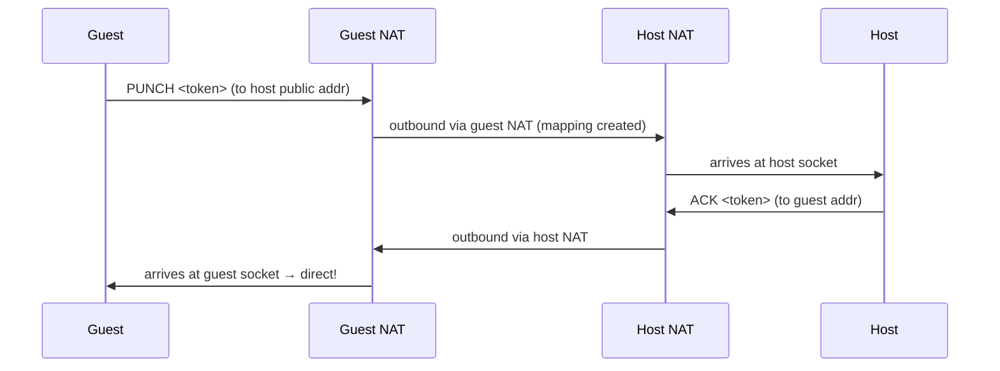
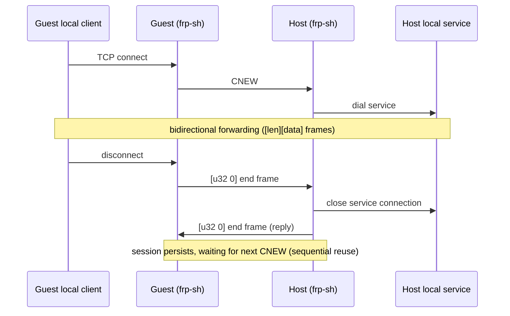
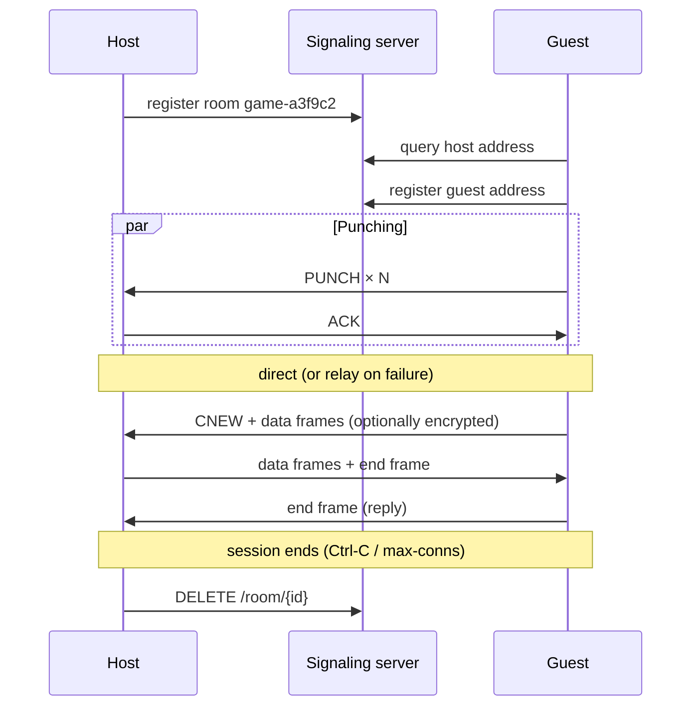

# Architecture

The full data path has four layers: **signaling** (make a room) → **hole punching** (find the peer) → **reliable stream** (transport) → **tunnel** (bridge local TCP). Below, layer by layer.

## 1. Signaling: room-based address exchange

### Public address probing (STUN first, echo fallback)

A host behind NAT cannot know its own public address directly. frp-sh first tries **standard STUN** (RFC 5389 Binding, when `stun_addr` is configured, e.g. `stun.cloudflare.com:3478`); if STUN is unavailable it falls back to server echo (`ECHO`/`ADDR`):

```text
client UDP socket ──ECHO <token>──▶ signaling server
client UDP socket ◀─ADDR <token> <ip>:<port>── signaling server
```

The source address the server observes (`<ip>:<port>`) is that socket's NAT-mapped public address.

**Key point**: probing and punching use the **same socket**, so the advertised address is the mapping punching can use; the mapping stays valid for the socket's lifetime.

### Room registration and lookup

```text
POST /room/create {prefix, ttl, addr}  →  {room_id, host_addr}
GET  /room/{id}                        →  {host_addr, guest_addr, ...}
POST /room/{id}/join {addr}            →  {host_addr}
DELETE /room/{id}
```

- The host registers a room and advertises its public address
- The guest queries the room for the host address, then registers its own
- Rooms expire (`--ttl`); expired rooms are removed lazily

## 2. Hole punching: simultaneous PUNCH/ACK

### Why punching is needed

NAT drops inbound connections by default. But once a socket sends outbound, the NAT creates a mapping that admits replies from that destination (restricted cone NAT). Punching is about both sides sending first so each side's mapping gets opened toward the other.

### Flow



Both sides punch simultaneously (the host learns the guest address by polling the room and punches back), so **restricted cone NAT** is traversable — no strict send-then-receive ordering needed.

### Port spread (lightweight port prediction)

Symmetric NAT assigns different ports per destination. `--spread N` makes both sides also send to **±N adjacent ports**:

```text
target port: 52000
spread targets: 52000, 51999, 52001, 51998, 52002 (spread=2)
```

Some NATs map consecutive ports consecutively, so spreading improves the hit rate. Unmatched ports usually have no listener; the resulting ICMP noise is ignored. **Your own port is automatically excluded**, avoiding false self-punch detection.

### Decision rules

| Received | Action |
|----------|--------|
| `PUNCH <token>` | reply `ACK <token>`, record peer address → direct |
| `ACK <token>` with matching token | direct |
| FRS1 data frame | peer already in data phase → direct |

The punch window is about 3 seconds; on timeout it falls back to relay.

## 3. Reliable stream: the FRS1 framing protocol

UDP after punching is **unreliable** (loss/reorder). frp-sh implements a lightweight reliable byte stream (`FRS1`) on top:

### Frame format (15-byte header + payload)

```text
+------+------+------+------+------+------+------+------+------+------+------+------+------+------+------+
| magic "FRS1" | flags |   seq u32 BE   |   ack u32 BE   | len u16 BE  |       payload         |
|    (4B)    | (1B) |                |                |             |                       |
+------+------+------+------+------+------+------+------+------+------+------+------+------+------+------+
```

- `flags`: `0x01` = data, `0x02` = FIN (close), none = pure ACK
- `seq`: sender sequence number (unique per frame)
- `ack`: cumulative acknowledgment (highest contiguous seq received + 1)

### Reliability mechanisms

| Mechanism | Parameter | Notes |
|-----------|-----------|-------|
| Sliding window | 32 frames | go-back-N: out-of-order frames dropped, recovered by retransmit |
| Retransmit | 150ms | all unacknowledged frames resent |
| Cumulative ACK | — | acknowledges only contiguous data |
| Keepalive | 1s | idle peers exchange ACKs to keep NAT mappings alive |
| Flow control | 256KB/1MB buffers | bounded buffers + window backpressure |
| Close | FIN handshake | best-effort close if no ACK within 5s |

### Encryption (optional)

With `--key`, **data-frame payloads** are encrypted with ChaCha20-Poly1305:

- Key = SHA-256(passphrase) (32 bytes)
- nonce = frame seq (unique per frame; retransmits reuse the same ciphertext)
- ACK/FIN frames stay plaintext (no payload)
- On key mismatch, decryption fails and the session exits with an error

## 4. Tunnel: multi-connection framing

On top of the reliable stream sits TCP bridging. To support **multiple connections per session** (game reconnect, etc.), the tunnel layer has its own framing:

```text
Guest → Host: CNEW(4B)  [u32 len][payload]*  [u32 0]
Host → Guest: [u32 len][payload]*  [u32 0]
```

| Element | Meaning |
|---------|---------|
| `CNEW` | guest-side new connection (host dials its local service) |
| `[u32 len][payload]` | data frame (max 1 MiB) |
| `[u32 0]` | end frame: sent when the local connection closes; on receipt, reply one and end the connection |

### Connection lifecycle



Each direction is driven by **two long-lived tasks + bounded channels**, which structurally avoids the "select drops half-read data" concurrency trap.

## 5. Relay fallback

On punch timeout (~3s) or `--relay`, both sides fall back in this order:

```text
punch failure ──▶ TURN relay (when turn_providers is configured) ──failure──▶ private TCP relay
```

### 5a. TURN relay (UDP, preferred)

With `turn_providers` configured (built-in TURN / coturn / Cloudflare TURN), a punch failure goes to TURN first: both sides exchange **TURN relay addresses** (`host_turn_relay` / `guest_turn_relay`) over signaling, authorize each other with CreatePermission, and run the FRS1 reliable stream over the TURN relay (UDP — better traversal and latency than the TCP relay):

```text
Guest ──UDP──▶ TURN server ◀──UDP── Host
      (FRS1 frames wrapped in TURN Send/Data indications)
```

- With multiple providers, **Allocate in parallel and speed-test**, picking the one with the lowest RTT
- Auth: RFC 5389 long-term credential (MD5(user:realm:pass), rotating nonce)
- The data plane shares the same `UdpStream` (`DatagramSocket` abstraction) as direct connections; the upper tunnel logic is unchanged
- Built-in TURN server: `serve --turn` (RFC 5766 UDP subset, relay ports assigned randomly, CreatePermission gates peer traffic, auth reuses `--password`)

### 5b. Private TCP relay (fallback)

When TURN is not configured or unavailable, connect to the server's private TCP relay:

```text
Guest ──TCP──▶ Server (8081) ◀──TCP── Host
             (bidirectional copy after pairing)
```

```mermaid
sequenceDiagram
    participant G as Guest
    participant S as Server
    participant H as Host
    G->>S: HELLO <room> GUEST → WAIT
    H->>S: HELLO <room> HOST → OK (paired)
    Note over G,H: server copies both ways; ends are transparent
```

- Pairing waits up to 10 minutes, then `ERROR NO_PEER`
- The guest runs a **400ms late-direct re-check** after connecting to relay: if P2P is re-captured (handles "host punched, guest ACK lost" asymmetry), it switches back to direct immediately

## A full session timeline



## Robustness notes

- **Windows ICMP poisoning**: after sending to an unlistened port, the next recv/send returns WSAECONNRESET(10054) — detected and ignored; ACK sends retry
- **Self-punch protection**: punch targets exclude your own port; self-originated datagrams are ignored
- **Keepalive**: NAT mappings typically expire in 30–120s; the 1s ACK frames keep them alive
- **Best-effort close**: a missing FIN ACK does not error the session, so a vanished peer cannot wedge it
